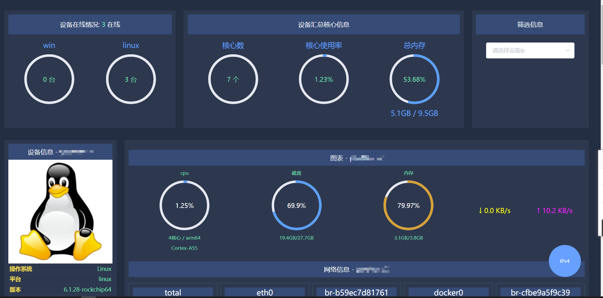

# starsnode

## 简介
starsnode基于websocket跨平台的系统状态监控软件，由一个服务端，n个客户端构成。

适用于基于内网的无公网ip环境，客户端会定时通过websocket上报数据给服务端，
服务端则暂存最新一次上报信息。
用户可以通过浏览器查看目前在线的所有客户端。

可展示信息包括：cpu、内存、硬盘、网速、网卡等信息，详细参考下方效果图

本库的js服务端参考了该项目：https://github.com/chaos-zhu/easynode，感谢原作者。

## 效果图

    

    

## 使用说明
待完成。。。
